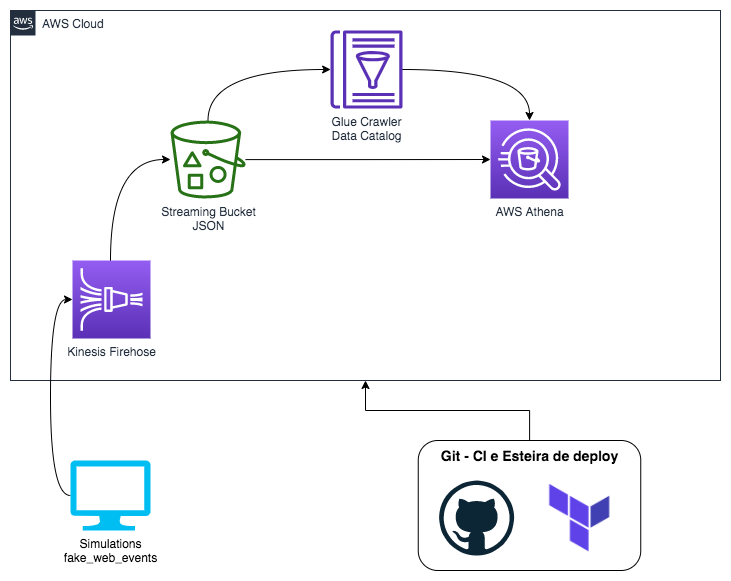

# Arquitetura Delta Lake com EMR, Terraform, Git - CI e Esteira de Deploy

Repositório com códigos e esteiras de deploy para a criação de uma arquitetura de Streaming de eventos com Kinesis, usando Glue Crawler, AWS Athena, com dados gerados por simulação de eventos utilizando a biblioteca fake_web_events 

## 1 - Streaming de eventos com Kinesis

Arquitetura da solução:

## 2 - Simulando eventos

Para simular eventos de streaming basta acessar a pasta raiz do projeto e executar o comando:

python3 simulations_to_kinesis.py